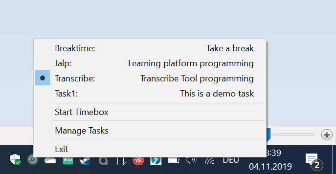

<p align="center">
    
</p>

<h3 align="center">Time-Tracker</h3>

<p align="center">
 A small systray task time tracker for Windows.
</p>
 <p align="center"></p>

## Table of contents

- [Quick start](#quick-start)
- [Status](#status)
- [Documentation](#documentation)
- [Versioning](#versioning)
- [Copyright and license](#copyright-and-license)

## Quick start

Download the release, unzip it and start the time-tracker.exe:

- [Download the latest release.](https://github.com/tscz/time-tracker/releases)

Read the [Documentation](#documentation) for developing and building infos.

## Status

[](https://travis-ci.com/tscz/time-tracker)

## Documentation

```text
time-tracker/
└── src/
    ├── time-tracker.au3 (Main application)
    ├── time-tracker-db.au3 (DB library for controlling the internal sqlite database)
    ├── time-tracker-excel.au3 (Excel export library)
    ├── time-tracker-gui.au3 (Configuration GUI)
└── lib/
    ├── sqlite3_29_0_x64.dll (DLL library for internal sqlite database)
```

## Versioning

## Copyright and license
This project is licensed under the MIT License - see the [LICENSE](LICENSE) file for details

http://www.iconarchive.com/show/flat-retro-modern-icons-by-grafikartes/time-machine-icon.html
