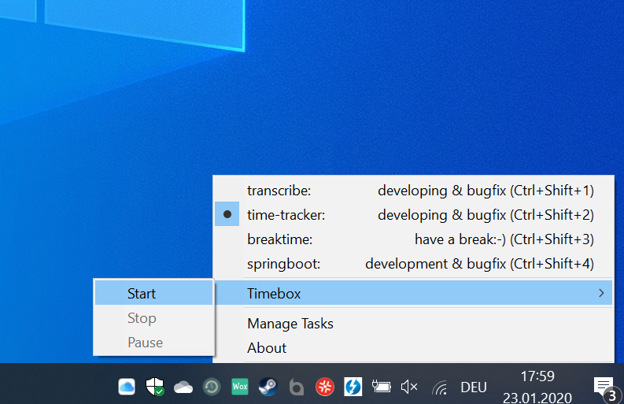

<p align="center">
    
</p>

<h3 align="center">Time-Tracker</h3>

<p align="center">
 A small systray task time tracker for Windows.
</p>
 <p align="center"></p>

## Table of contents

- [Quick start](#quick-start)
- [Status](#status)
- [Documentation](#documentation)
- [Versioning](#versioning)
- [Copyright and license](#copyright-and-license)

## Quick start

Download the release, unzip it and start the time-tracker.exe:

- [Download latest release here](https://github.com/tscz/time-tracker/releases)

Read the [Documentation](#documentation) for developing and building infos.

## Status

[](https://travis-ci.com/tscz/time-tracker)

## Documentation
### Overview

This application is developed in [AutoIt](https://www.autoitscript.com/site/). You need Windows to develop and build it and
* AutoIt (with SciTE editor) for build and development
* (optional) Bash shell for starting the build script (i.e. Git Bash)
*  (optional) 7z if you want to build a local release

The implementation is spread over multiple scripts. 

```text
time-tracker/
└── src/
    ├── time-tracker.au3        (Main application)
    ├── time-tracker-db.au3     (DB library for controlling the internal sqlite database)
    ├── time-tracker-excel.au3  (Excel export library)
    ├── time-tracker-gui.au3    (Configuration GUI)
└── lib/
    ├── sqlite3_29_0_x64.dll    (DLL library for internal sqlite database)
└── doc/                        (Documentation)
└── build.sh                    (Build script)    
```

### Setup IDE and Build
The easiest way to setup the development environment is via [chocolatey](https://chocolatey.org/):
```bash
choco install autoit
choco install 7zip
```

The development IDE sciTE is installed with AutoIt and an be started as follows:
```bash
git clone https://github.com/tscz/time-tracker.git
cd time-tracker
scite src/time-tracker.au3
```

The build can be triggered within a bash shell:
```bash
cd time-tracker
./build.sh
```

## Versioning
| Version | Info
| --- | --- 
| 0.1 | First running version
| [0.2](https://github.com/tscz/time-tracker/releases/tag/v0.2) | Add timebox mode
| [0.2.1](https://github.com/tscz/time-tracker/releases/tag/v.0.2.1) | Minor bugfixes

## Copyright and license
This project is licensed under the MIT License - see the [LICENSE](LICENSE) file for details

http://www.iconarchive.com/show/flat-retro-modern-icons-by-grafikartes/time-machine-icon.html
